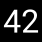

[[ENG](README.eng.md)]

# escolher-numero

  

Um programa de **linha de comandos** \(interface de linha de comandos – ILC, mais conhecido pelo termo em inglês [*command-line interface*](https://en.wikipedia.org/wiki/Command-line_interface) – CLI\) escrito em [**Python**](https://www.python.org/) e [**Go**](https://golang.org/).

## Origem

O software foi inspirado numa aplicação de smartphone utilizada pelo meu professor da disciplina *Biologia e Geologia* no 11º ano. O professor utiliza essa aplicação para gerar dois números aleatórios que vão determinar os alunos que irão responder a algumas (geralmente três) perguntas sobre a matéria.

## Capacidades do software

Este programa permite **gerar números aleatoriamente** e **atirar uma moeda ao ar** (o que é a mesma coisa que números aleatórios mas com outros nomes e só dois números (cara ou coroa)).

## História do desenvolvimento

A versão em Python foi desenvolvida primeiro e só depois veio a versão em Go. Decidi tentar criar uma versão em Go, devido a esta linguagem ser compilada para código binário, o que permite uma **distribuição mais fácil do software**. Por outro lado, Python é uma linguagem interpretada por um "interpretador" no momento de execução. Também é possível obter ficheiros binários de programas escritos em Python mas a linguagem não foi feita para isso, devido a ser dinâmica, entre outros aspetos, sendo necessária a compilação por software não oficial, enquanto que no caso de Go existe o compilador oficial.

## Licença

Este projeto está licenciado sob a **The Unlicense**. [Mais informações](https://choosealicense.com/licenses/unlicense/)  
This project is licensed under the **The Unlicense**. [More info](https://choosealicense.com/licenses/unlicense/)

Ver [LICENSE](LICENSE)  
See [LICENSE](LICENSE)

[releases]: https://github.com/a21989/escolher-numero/releases